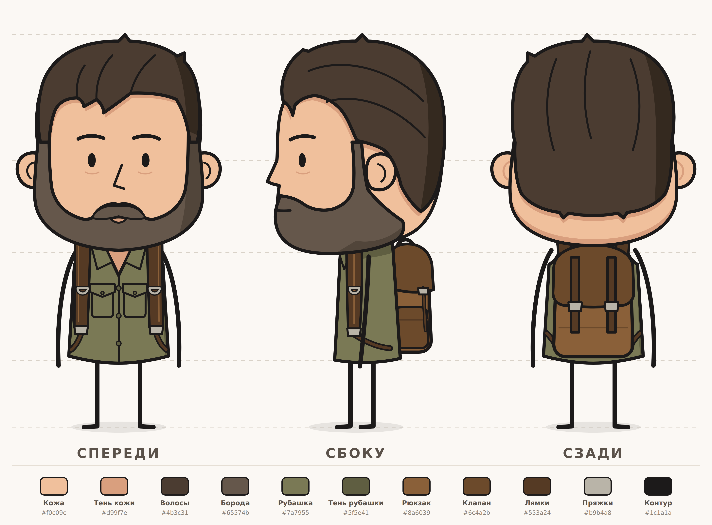

# Персонажи — развороты (спереди / сбоку / сзади)

Все персонажи нарисованы в стиле первого референса: большая голова, простое лицо
(глаза-овалы, нос «уголком»), толстый чёрный контур, плоская заливка с одной тенью.
**Руки и ноги — палки.**

## Элли


- **Одежда:** красная майка без рукавов.
- **Волосы:** каштановые с рыжиной — боковой пробор, чёлка набок, пряди у лица,
  хвост на тёмной резинке.
- **Рюкзак:** чёрно-серый. Спереди лямки с пряжками и нагрудным ремешком, сбоку — рюкзак
  в профиль с боковым карманом, сзади — молния и передний карман.
- Веснушки на щеках.

## Джоэл



- **Одежда:** рубашка цвета хаки без рукавов — воротник, планка с пуговицами, два
  нагрудных кармана с клапанами.
- **Голова:** короткие тёмные волосы, короткая борода с проседью и усы, густые брови.
- **Рюкзак:** коричневый. Спереди лямки с металлическими D-кольцами и пряжками, сбоку —
  клапан и боковой карман, сзади — клапан с двумя ремешками на пряжках.
- **Рост:** Джоэл выше Элли. Его холст 600×1100 вместо 600×1000, земля на том же отступе
  снизу, поэтому в одном масштабе рост соотносится правильно.

## Файлы

| Путь | Что это |
|---|---|
| `characters/<имя>/front.svg`, `side.svg`, `back.svg` | отдельные виды, вектор |
| `characters/<имя>/turnaround.svg` | лист-разворот: три вида, направляющие по высоте, палитра |
| `characters/<имя>/png/*.png` | те же файлы в PNG ×2; отдельные виды — на прозрачном фоне |
| `tools/ellie.py`, `tools/joel.py` | формы и палитра каждого персонажа |
| `tools/charlib.py` | общие функции: примитивы SVG, лист-разворот |
| `tools/build_characters.py` | сборка SVG |
| `tools/render.js` | рендер SVG → PNG |

## Слои для анимации

Каждая часть лежит в отдельной группе `<g id="вид-часть">`, например `front-arm-left`,
`side-beard`, `back-backpack`. `left`/`right` — сторона самого персонажа: на виде спереди
`front-arm-left` находится справа от зрителя.

| Персонаж и вид | Группы (снизу вверх по порядку отрисовки) |
|---|---|
| Элли, спереди | `ponytail`, `hair-back`, `leg-right`, `leg-left`, `arm-right`, `arm-left`, `neck`, `top`, `backpack-straps`, `ear-right`, `ear-left`, `face`, `face-features`, `hair-lock-left`, `hair-lock-right`, `hair-tuft`, `hair` |
| Элли, сбоку | `ponytail`, `leg-left`, `leg-right`, `backpack`, `top`, `backpack-strap`, `arm-right`, `head`, `face-features`, `ear-right`, `hair-lock-right`, `hair-tuft`, `hair`, `hair-tie` |
| Элли, сзади | `leg-left`, `leg-right`, `arm-left`, `arm-right`, `top`, `backpack`, `ear-left`, `ear-right`, `head`, `hair-tuft`, `hair`, `ponytail`, `hair-tie` |
| Джоэл, спереди | `hair-back`, `leg-right`, `leg-left`, `arm-right`, `arm-left`, `neck`, `shirt`, `backpack-straps`, `ear-right`, `ear-left`, `face`, `face-features`, `beard`, `hair` |
| Джоэл, сбоку | `leg-left`, `leg-right`, `backpack`, `shirt`, `backpack-strap`, `arm-right`, `head`, `ear-right`, `face-features`, `beard`, `hair` |
| Джоэл, сзади | `leg-left`, `leg-right`, `arm-left`, `arm-right`, `shirt`, `backpack`, `ear-left`, `ear-right`, `head`, `hair` |

Руки и ноги — одиночные линии; первая точка пути — плечо или бедро, её удобно брать за
точку поворота.

## Палитры

| Что | Элли | Джоэл |
|---|---|---|
| Кожа / тень | `#f8ccb1` / `#e8ab8e` | `#f0c09c` / `#d99f7e` |
| Волосы / тень | `#8a4b2f` / `#6a3521` | `#4b3c31` / `#34291f` |
| Борода / тень | — | `#65574b` / `#51453a` |
| Одежда / тень | майка `#c2423a` / `#9c332e` | рубашка хаки `#7a7955` / `#5f5e41` |
| Рюкзак / карманы, клапан | `#4b4f55` / `#3b3e43` | `#8a6039` / `#6c4a2b` |
| Ремни, лямки | `#2a2c30` | `#553a24` |
| Пряжки, металл | `#8e949b` | `#b9b4a8` |
| Веснушки | `#d4917a` | — |
| Контур | `#1c1a1a` | `#1c1a1a` |

## Как пересобрать

```bash
python3 tools/build_characters.py        # SVG всех персонажей (или: ... joel)

# PNG: нужен Node.js и Playwright (ставится один раз)
npm i --no-save playwright && npx playwright install chromium
node tools/render.js                     # PNG ×2 (или: node tools/render.js 2 joel)
```
