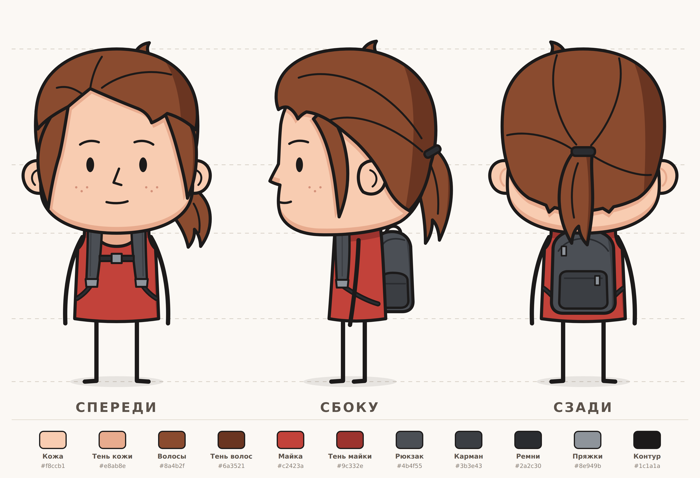

# Персонаж — разворот (спереди / сбоку / сзади)



Персонаж нарисован в стиле первого референса: большая голова, простое лицо (глаза-овалы,
нос «уголком», рот-чёрточка), толстый чёрный контур, плоская заливка с одной тенью.
**Руки и ноги — палки.**

- **Одежда:** красная майка без рукавов.
- **Волосы:** каштановые с рыжиной, как на остальных картинках: боковой пробор, чёлка набок,
  пряди у лица, хвост на тёмной резинке.
- **Рюкзак:** чёрно-серый. Спереди видны лямки с пряжками и нагрудный ремешок, сбоку —
  рюкзак в профиль с боковым карманом, сзади — молния и передний карман.
- Веснушки на щеках.

## Файлы

| Файл | Что это |
|---|---|
| `character/front.svg`, `side.svg`, `back.svg` | отдельные виды, вектор 600×1000 |
| `character/turnaround.svg` | лист-разворот: три вида, направляющие по высоте, палитра |
| `character/png/*.png` | те же файлы в PNG ×2; отдельные виды — на прозрачном фоне |
| `tools/build_character.py` | генератор SVG: все формы и цвета заданы здесь |
| `tools/render.js` | рендер SVG → PNG |

## Слои для анимации

Каждая часть лежит в отдельной группе `<g id="вид-часть">`, например `front-arm-left`,
`side-ponytail`, `back-backpack`. `left`/`right` — сторона самого персонажа: на виде спереди
`front-arm-left` находится справа от зрителя.

| Вид | Группы (снизу вверх по порядку отрисовки) |
|---|---|
| спереди | `ponytail`, `hair-back`, `leg-right`, `leg-left`, `arm-right`, `arm-left`, `neck`, `top`, `backpack-straps`, `ear-right`, `ear-left`, `face`, `face-features`, `hair-lock-left`, `hair-lock-right`, `hair-tuft`, `hair` |
| сбоку | `ponytail`, `leg-left`, `leg-right`, `backpack`, `top`, `backpack-strap`, `arm-right`, `head`, `face-features`, `ear-right`, `hair-lock-right`, `hair-tuft`, `hair`, `hair-tie` |
| сзади | `leg-left`, `leg-right`, `arm-left`, `arm-right`, `top`, `backpack`, `ear-left`, `ear-right`, `head`, `hair-tuft`, `hair`, `ponytail`, `hair-tie` |

Руки и ноги — одиночные линии; первая точка пути — плечо или бедро, её удобно брать за
точку поворота.

## Палитра

| Что | Цвет | Тень |
|---|---|---|
| Кожа | `#f8ccb1` | `#e8ab8e` |
| Волосы | `#8a4b2f` | `#6a3521` |
| Майка | `#c2423a` | `#9c332e` |
| Рюкзак | `#4b4f55` | `#3b3e43` (карманы) |
| Ремни, молнии, резинка | `#2a2c30` | |
| Пряжки, бегунки | `#8e949b` | |
| Веснушки | `#d4917a` | |
| Контур | `#1c1a1a` | |

## Как пересобрать

```bash
python3 tools/build_character.py        # SVG в character/

# PNG: нужен Node.js и Playwright (ставится один раз)
npm i --no-save playwright && npx playwright install chromium
node tools/render.js                     # PNG ×2 в character/png/
```
