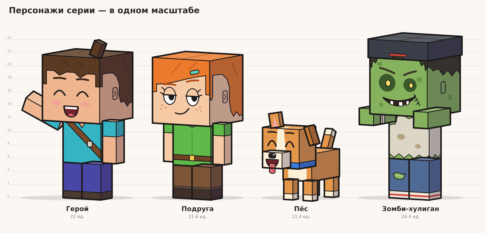
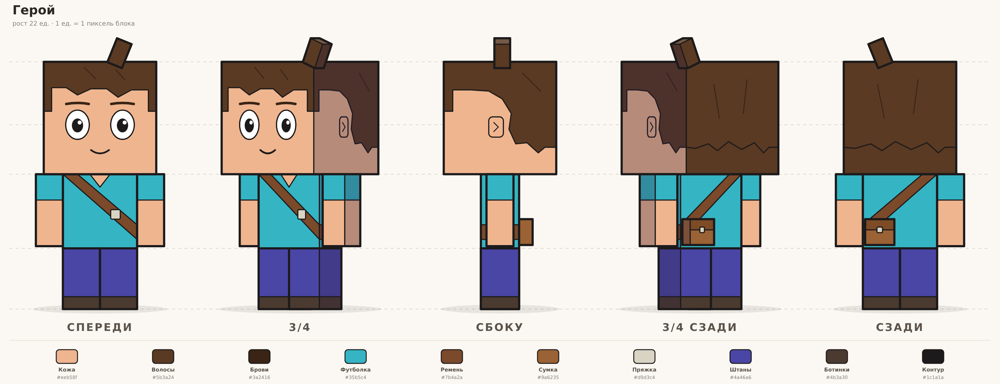
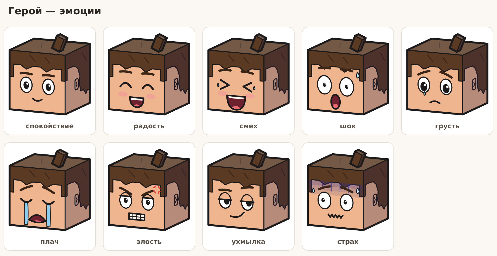
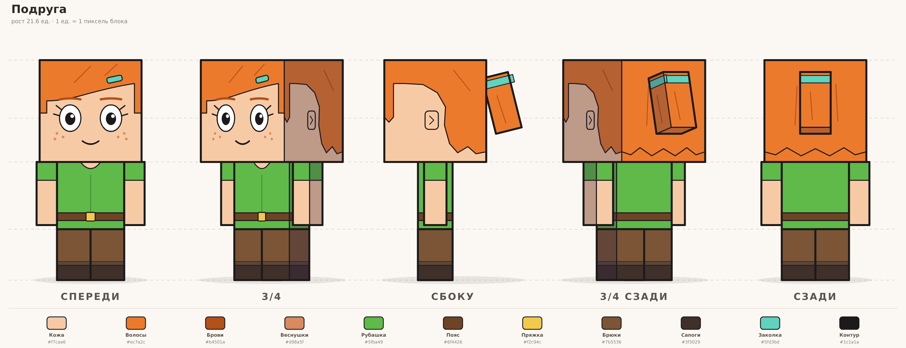
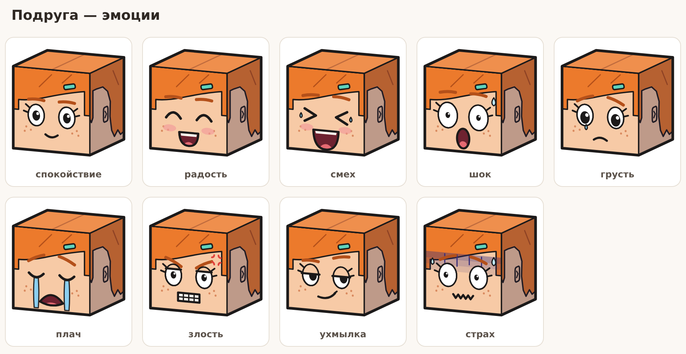
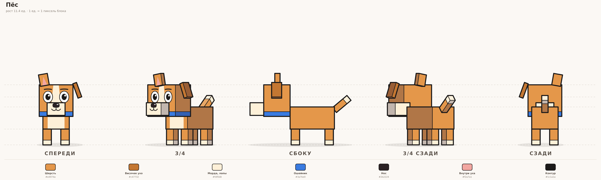
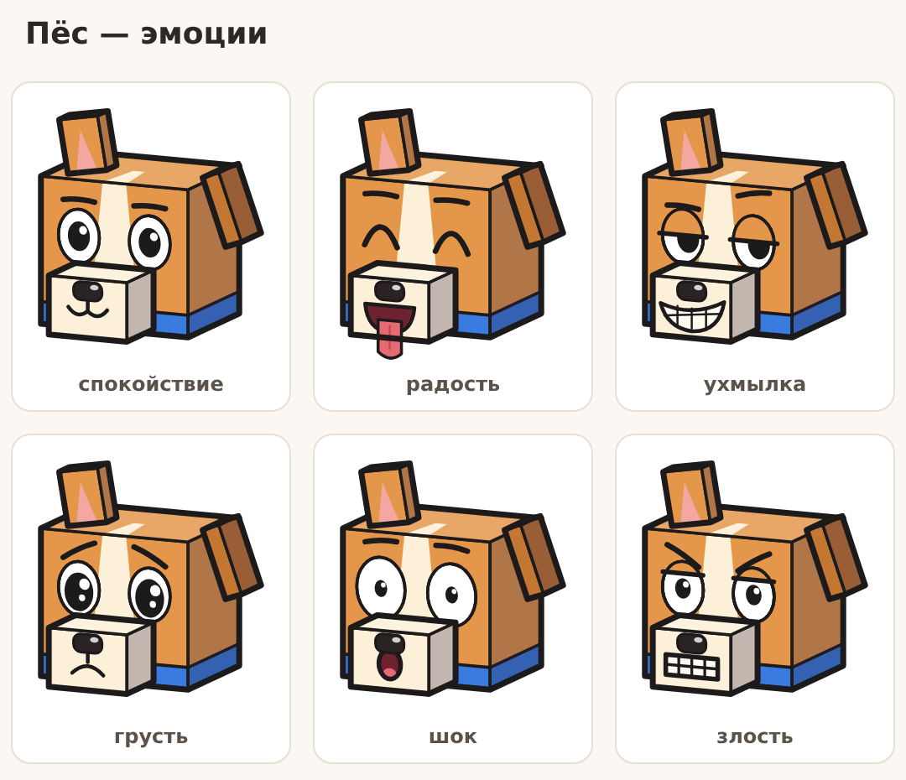
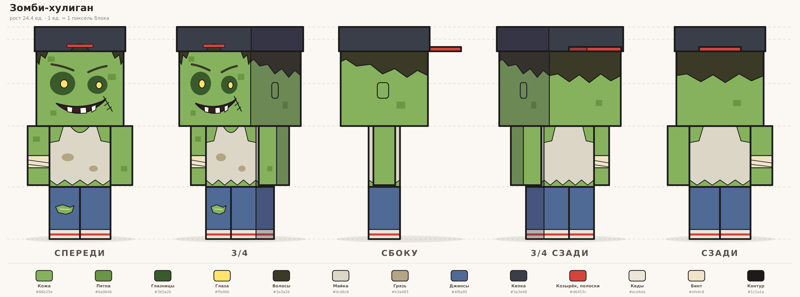
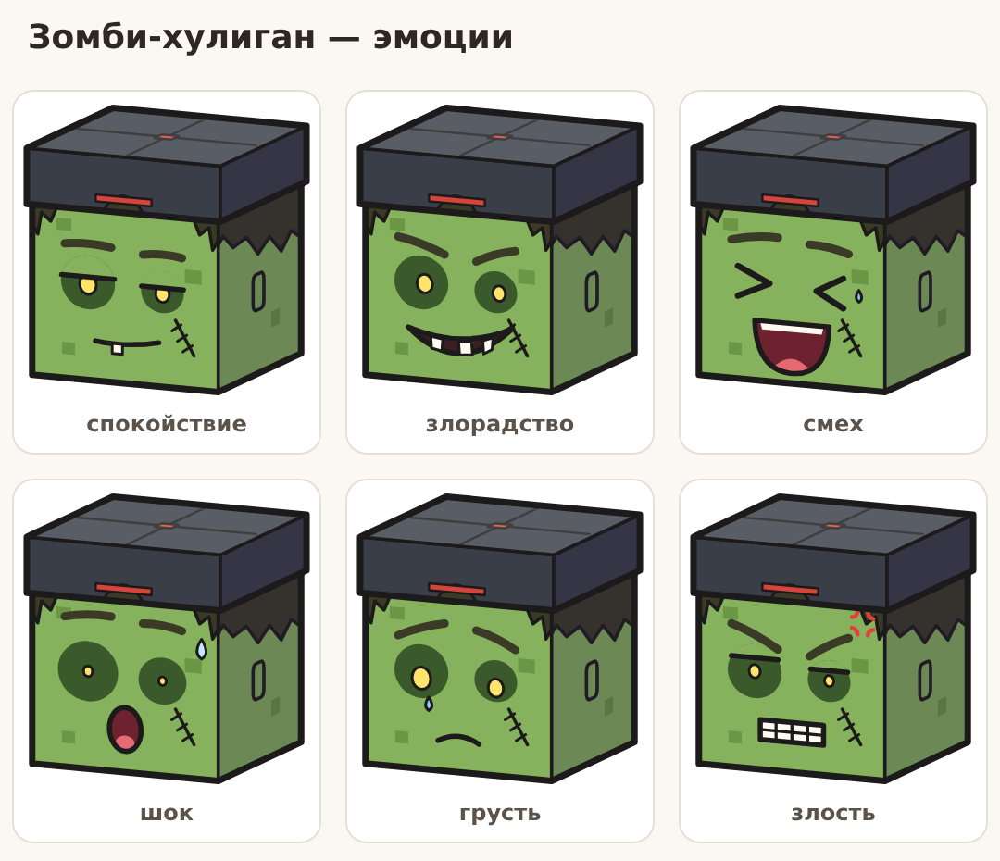

# Серия Minecraft-шортсов

Короткие анимационные истории с блочными персонажами «как из Minecraft, но своими».
Формат — **вертикальный 9:16, 1080×1920**.

| Этап | Статус | Где |
|---|---|---|
| Анализ ниши и канала Kopee | готово | [research-kopee.md](research-kopee.md) |
| Концепт персонажей | готово | этот файл, [`characters/`](characters) |
| Первый сценарий | следующий шаг | — |
| Фоны под сценарий | после сценария | — |

## Персонажи

Стиль: кубическая голова и тело, живое мультяшное лицо, плоская заливка, одна тень на боковых
гранях, светлая верхняя грань, толстый чёрный контур. Пропорции «чиби»: голова — почти
половина роста, чтобы эмоции читались на телефоне с первого кадра. Для хука это главное:
в первую секунду зритель должен увидеть **лицо с яркой эмоцией** (шок, страх, злость).



### Герой



- **Роль:** добрый и доверчивый, вечно попадает в неприятности. Через него зритель
  переживает проблему из хука.
- **Узнаётся по:** бирюзовой футболке, фиолетовым штанам и каштановым волосам — архетип
  Стива. Отличия: хохолок на макушке, ремень через плечо с пряжкой, сумка на поясе сзади,
  уши на боках головы.
- **Рост:** 22 ед. (голова 10×10×10).



### Подруга



- **Роль:** умная и язвительная, «всегда права». Идеальна для реакций, ухмылок и мемов в духе
  «спорить с девушкой, которая всегда права».
- **Узнаётся по:** рыжим волосам, зелёной рубашке и коричневым брюкам — архетип Алекс.
  Отличия: косая чёлка с мятной заколкой, хвост на мятной резинке, веснушки, ресницы, пояс с
  жёлтой пряжкой, сапоги, руки тоньше, чем у Героя.
- **Рост:** 21,6 ед.



### Пёс



- **Роль:** верный компаньон Героя и двигатель твистов. Оба главных хита канала держатся на
  собаке: «пёс достал меч из лавы» (22M) и «пёс спасал зомби» (20,9M).
- **Узнаётся по:** рыжему окрасу, белой полосе на лбу, белой морде и лапам, синему ошейнику.
  Отличие от волка Minecraft: окрас, одно ухо стоит, другое висит, крупная голова.
- **Рост:** 11,4 ед. (до макушки, без ушей).



### Зомби-хулиган



- **Роль:** задира и антагонист, который может оказаться хорошим. Сюжет «злодею не обязательно
  быть злодеем» собрал на канале 20,9M.
- **Узнаётся по:** зелёной коже и светящимся жёлтым глазам. Отличия: кепка козырьком назад,
  грязная майка с рваным низом, рваные джинсы, кеды, бинт на руке, шрам со стежками на щеке.
  Глаза разного размера.
- **Рост:** 24,4 ед. с кепкой — выше всех, давит ростом.
- **Фирменная поза:** руки вытянуты вперёд (на общем листе).



## Файлы

| Путь | Что это |
|---|---|
| `characters/<имя>/front.svg`, `three-quarter.svg`, `side.svg`, `three-quarter-back.svg`, `back.svg` | отдельные виды, вектор |
| `characters/<имя>/turnaround.svg` | лист-разворот: 5 видов, направляющие, палитра |
| `characters/<имя>/expressions.svg` | лист эмоций (голова в 3/4 сверху) |
| `characters/lineup.svg` | все персонажи рядом в одном масштабе, в характерных позах |
| `characters/**/png/*.png` | те же файлы в PNG; отдельные виды — на прозрачном фоне |
| `tools/blocky.py` | движок: коробки → SVG под любым углом камеры |
| `tools/faces.py` | глаза, брови, рты, слёзы — детали эмоций |
| `tools/characters.py` | персонажи: размеры коробок, палитры, одежда, эмоции |
| `tools/build.py`, `tools/render.js` | сборка SVG и рендер PNG |

Имена — `hero` (Герой), `friend` (Подруга), `dog` (Пёс), `zombie` (Зомби-хулиган).

## Слои для анимации

Каждая коробка — отдельная группа `<g id="вид-часть">`, например `front-head`,
`three-quarter-arm-left`, `side-tail`. Внутри неё грани — `<g class="face-front">`,
`face-left` и т. д.; лицо нарисовано на `face-front` головы. `left`/`right` — сторона самого
персонажа: на виде спереди `arm-left` справа от зрителя.

| Персонаж | Части |
|---|---|
| Герой | `head`, `tuft`, `body`, `pouch`, `arm-left`, `arm-right`, `leg-left`, `leg-right` |
| Подруга | `head`, `ponytail`, `body`, `arm-left`, `arm-right`, `leg-left`, `leg-right` |
| Пёс | `head`, `snout`, `ear-left` (висячее), `ear-right` (стоячее), `body`, `tail`, `leg-front-left`, `leg-front-right`, `leg-back-left`, `leg-back-right` |
| Зомби | `head`, `cap`, `brim`, `body`, `arm-left`, `arm-right`, `leg-left`, `leg-right` |

**Точки поворота:** руки — середина верхней грани (плечо), ноги — середина верхней грани
(бедро), голова — середина нижней грани (шея), хвост Пса — у тела, уши — у макушки.

Порядок слоёв зависит от ракурса: на виде спереди голова поверх тела, сзади сумка Героя и хвост
Подруги поверх спины. В SVG группы уже идут в нужном порядке для каждого вида.

## Палитры

| Что | Цвет |
|---|---|
| Контур | `#1c1a1a`, толщина 7 px по силуэту, 3,6 px внутри |
| Тень боковых граней | `#2b2140` с прозрачностью 28 % поверх цвета |
| Свет верхних граней | белый с прозрачностью 16 % |

| Герой | | Подруга | | Пёс | | Зомби | |
|---|---|---|---|---|---|---|---|
| Кожа | `#eeb58f` | Кожа | `#f7caa6` | Шерсть | `#e4974a` | Кожа | `#86b25e` |
| Волосы | `#5b3a24` | Волосы | `#ec7a2c` | Висячее ухо | `#c47732` | Пятна | `#6a9646` |
| Брови | `#3a2416` | Брови | `#b4501a` | Морда, лапы | `#fdf0d8` | Глазницы | `#3b5a2b` |
| Футболка | `#35b5c4` | Рубашка | `#5fba49` | Ошейник | `#3a7be0` | Глаза | `#ffe46b` |
| Ремень | `#7b4a2a` | Пояс | `#6f4426` | Нос | `#2b2224` | Майка | `#dcd6c6` |
| Сумка | `#9a6235` | Пряжка | `#f2c94c` | Внутри уха | `#f2a7a1` | Джинсы | `#4f6a95` |
| Штаны | `#4a46a6` | Брюки | `#7b5536` | | | Кепка | `#3a3e48` |
| Ботинки | `#4b3a30` | Сапоги | `#3f3029` | | | Козырёк | `#d6453c` |
| Пряжка | `#d9d3c4` | Заколка | `#5fd3bd` | | | Кеды | `#ece6da` |

## Как пересобрать

```bash
python3 minecraft/tools/build.py          # SVG всех персонажей и общий лист (или: ... dog)
node minecraft/tools/render.js            # PNG (нужен Playwright: npm i --no-save playwright)
node minecraft/tools/render.js 2          # PNG ×2
```

Поменять цвет, размер коробки или эмоцию — в `tools/characters.py`; все виды и листы
пересобираются из одной модели, поэтому остаются согласованными между собой.
