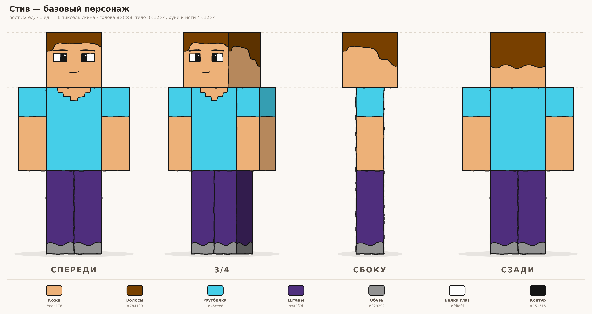
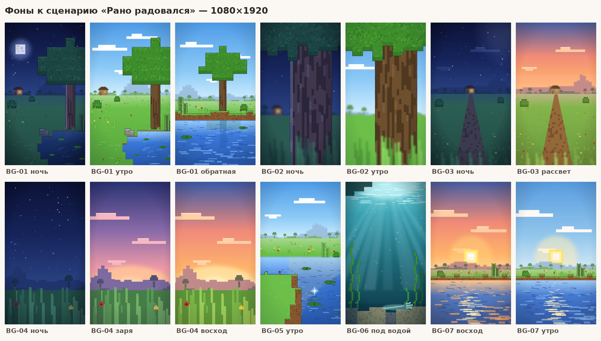

# Серия Minecraft-шортсов

Короткие анимационные истории в стиле рисованных Minecraft-анимаций.
Формат — **вертикальный 9:16, 1080×1920**.

| Этап | Статус | Где |
|---|---|---|
| Анализ ниши и канала Kopee | готово | [research-kopee.md](research-kopee.md) |
| Концепт персонажа | готово | этот файл, [`characters/steve/`](characters/steve) |
| Первый сценарий «Рано радовался» | готово | [scenarios/01-laughed-too-early.md](scenarios/01-laughed-too-early.md) |
| Фоны под сценарий (BG-01…BG-07) | готово | [раздел «Фоны»](#фоны) · [`backgrounds/`](backgrounds) |

## Персонаж

Стиль — **чиби-стикеры по Minecraft** (референс — лист стикеров с мобами). Что взято из
референса:

- **Пропорции чиби:** голова больше 40 % роста и в 1,4 раза шире тела, руки и ноги короткие
  и толстые.
- **Форма:** блоки со скруглёнными углами, голова почти «подушка».
- **Контур:** толстый, тёмный, только по силуэту каждой части. Снизу и справа он толще, как
  кистью. Внутренние рёбра без линий — только сменой тона.
- **Свет и тень:**
  - верхняя грань светлее, обращённая к камере — основной цвет, боковые — тёплая тень;
  - от головы на тело и от тела на ноги падает тень;
  - на гранях мягкий градиент: верх светлее, низ темнее.
- **Текстура:** редкие «пиксели» чуть другого тона на волосах, футболке и штанах — намёк на
  скин Minecraft.
- **Лицо:** маленькое и сидит низко. Глаза — скруглённые прямоугольники с фиолетовым зрачком
  у переносицы и бликом, под ними коричневая «борода» с улыбкой, как у Стива на стикере.
- **Камера:** чуть сверху (10°), видна макушка.

Это базовая модель. Девушку, зомби и других героев делаем из неё: меняем цвета, дорисовываем
волосы и детали.



- **Размеры (единицы):** голова 10×10×10, тело 7,2×7,6×4,6, руки 2,9×6,8×3, ноги 3,6×5,8×3,9,
  рост 23,2.
- **Руки** чуть разведены от тела (на 7°), чтобы силуэт не сливался.

## Файлы

| Путь | Что это |
|---|---|
| `characters/steve/front.svg`, `three-quarter.svg`, `side.svg`, `back.svg` | отдельные виды, вектор |
| `characters/steve/turnaround.svg` | лист: 4 вида, направляющие по высоте, палитра |
| `characters/steve/png/*.png` | те же файлы в PNG ×2; отдельные виды — на прозрачном фоне |
| `tools/steve.py` | персонаж: размеры, цвета, волосы, лицо, одежда |
| `tools/blocky.py` | движок: модель из блоков → SVG под любым углом камеры |
| `tools/build.py`, `tools/render.js` | сборка SVG и рендер PNG |

## Слои для анимации

Каждая часть — отдельная группа `<g id="вид-часть">`: `head`, `body`, `arm-left`,
`arm-right`, `leg-left`, `leg-right` (например `three-quarter-arm-left`). Внутри — грани
`<g class="face-front">`, `face-left` и т. д.; лицо нарисовано на `face-front` головы.
`left`/`right` — сторона самого персонажа: на виде спереди `arm-left` справа от зрителя.
Группы в каждом файле уже стоят в нужном порядке наложения для этого ракурса.

**Точки поворота:** руки — середина верхней грани (плечо), ноги — середина верхней грани
(бедро), голова — середина нижней грани (шея).

## Палитра

| Что | Цвет |
|---|---|
| Кожа | `#f0c39c` |
| Борода, рот | `#a8714d` (полупрозрачный) |
| Волосы / светлые пиксели | `#6b4226` / `#a0704a` |
| Футболка | `#38c0d6` |
| Штаны | `#4b48b0` |
| Обувь | `#8a8a93` |
| Зрачки | `#4b3c9e` |
| Контур | `#22201f`, 8,5 px по силуэту (на холсте 1000 px) |
| Тень боковых граней | `#cfa8a4` в режиме «умножение» |
| Свет верхних граней | белый, 20 % |

## Как пересобрать

```bash
python3 minecraft/tools/build.py          # SVG
node minecraft/tools/render.js 2          # PNG ×2 (нужен Playwright: npm i --no-save playwright)
```

Цвета, размеры, волосы и лицо меняются в `tools/steve.py`; все четыре вида пересобираются из
одной модели и остаются согласованными. Тени в SVG сделаны режимом наложения «умножение» —
браузеры и Inkscape его показывают; если программа его не понимает, берите PNG.

## Фоны

Фоны к сценарию №1 в стиле фонов Kopee:

- **Форма:** всё блочное — деревья с квадратной кроной, ступенчатые холмы и берега.
- **Цвет:** плоская заливка с мягкими градиентами, небо — градиент, облака — плоские белые блоки.
- **Обводка:** тонкая тёмная, слегка неровная, только у ближних и средних объектов.
- **Пиксели** — только как акцент: листва, вода, кора, дно.
- **Глубина:** дальний план размыт, по краям кадра виньетка.

Размер — **1080×1920 (9:16)**.



| Фон | Что это | Ракурс | Варианты | Кадры |
|---|---|---|---|---|
| **BG-01** `bg01-meadow` | поляна: большой дуб справа, пруд справа внизу, камни, тростник; вдали гора и домик Стива (ночью в окне свет) | общий, сбоку, камера на уровне груди, горизонт y 980 | `night`, `morning`, `reverse-morning` (с обратной стороны пруда: из воды на берег и дуб) | 2, 8, 10; обратная — 15 |
| **BG-02** `bg02-trunk` | ствол дуба крупно (кора), сверху нависает крона, слева размытые поле и небо | крупный, чуть снизу | `night`, `morning` | 1, 4, 5, 9, 14, 16 |
| **BG-03** `bg03-field` | от дерева в поле: тропинка к домику на горизонте, кусты, цветы | на уровне глаз, горизонт y 960 | `night`, `sunrise` | 3, 7 |
| **BG-04** `bg04-sky` | огромное небо, холмы и гора на горизонте, крупная трава на переднем плане | сильно снизу, из травы, горизонт y 1430 | `night`, `dawn`, `sunrise` — три состояния неба для перехода | 6 |
| **BG-05** `bg05-bank` | ближний берег ступенями из блоков дёрна, пруд, кувшинки, тростник, дальний берег | средний, сбоку в 3/4 | `morning`; блик трезубца на дне — слой `props` | 11 |
| **BG-06** `bg06-underwater` | под водой: светлая рябь поверхности, лучи, пузыри, морская трава, дно из песка и гравия, тёмный край берега сверху | со дна вверх | `underwater`; трезубец на дне — слой `props` | 12 |
| **BG-07** `bg07-water-level` | гладь пруда у самой камеры, дальний берег, низкое солнце сзади, дорожка бликов | сильно снизу, с уровня воды | `sunrise` (контровой свет, для обложки), `morning` | 13 |

**Как кадры связаны со сценарием:**

- Переход ночь → утро в кадре 5 — наплыв BG-02 `night` на `morning`.
- Восход в кадре 6 — смена неба BG-04 `night` → `dawn` → `sunrise`; спрайт солнца поднимается из-за холмов в центре (x 540).
- В BG-01 и BG-03 домик на горизонте один и тот же. Зомби пришёл с той стороны, откуда видно домик.

### Файлы и слои

| Путь | Что это |
|---|---|
| `backgrounds/<фон>/png/<вариант>.png` | фон целиком, 1080×1920 |
| `backgrounds/<фон>/<вариант>.svg` | то же в векторе, слои — группы `far`, `mid`, `props`, `near`, `fx` |
| `backgrounds/<фон>/layers/png/<вариант>-<слой>.png` | слои по отдельности, на прозрачном фоне — для параллакса |
| `backgrounds/sprites/png/sun.png`, `moon.png` | квадратные солнце и луна Minecraft со свечением — чтобы анимировать отдельно |
| `backgrounds/overview.png` | все фоны на одном листе |
| `tools/bgkit.py` | палитры ночь / заря / рассвет / утро и детали: небо, облака, холмы, дуб, трава, цветы, вода, тростник, домик |
| `tools/scenes.py` | сами фоны BG-01…BG-07 и спрайты |
| `tools/build_backgrounds.py` | сборка SVG |

**Слои снизу вверх:**

- `far` — небо, облака, солнце или луна, холмы, гора, домик (размыты);
- `mid` — земля, дерево, пруд, кусты, камни;
- `props` — то, что анимируется отдельно: блик и трезубец на дне;
- `near` — трава и цветы у самой камеры;
- `fx` — виньетка и общий тон (ночью — синий, на рассвете — тёплый).

Для параллакса двигайте `far` медленнее всего, `near` — быстрее всего.

### Как пересобрать фоны

```bash
python3 minecraft/tools/build_backgrounds.py              # все фоны (или: ... bg02-trunk)
node minecraft/tools/render.js 1 minecraft/backgrounds    # PNG 1080×1920 и слои
```

